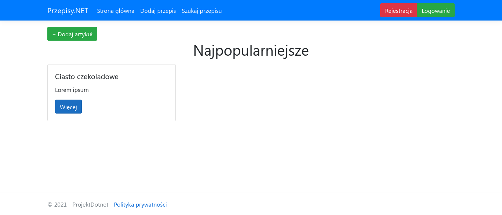

# ProjektDotnet

It is a simple application to manage recipes using ASP.NET Core.



## Prerequisites

- [.NET 6 SDK](https://dotnet.microsoft.com/en-us/download/dotnet/6.0)

## Running

Open a command prompt and type 

```
dotnet run
```
or 
```
dotnet watch run
```
